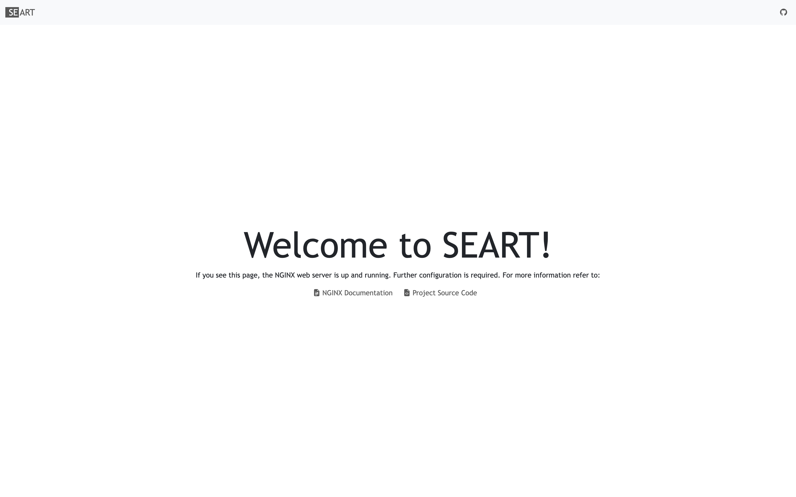

# SEART reverse-proxy

## About

To coordinate traffic to our web services, we make use of a custom NGINX web-server, acting as a reverse-proxy.
Said server comes bundled with a default configuration file, which can be further customized by placing additional
configuration files in a pre-determined directory. It includes other features such as a pre-defined Docker health
check and custom error pages that maintain stylistic consistency with the rest of our web services. 

## Example

Here's an example of how one could deploy this proxy through `docker-compose`:

```yaml
version: '3.9'
name: 'reverse-proxy'

services:

  proxy:
    container_name: reverse-proxy
    image: seart/reverse-proxy:latest
    restart: "always"
    ports:
      - "80:80"
      - "443:443"
    volumes:
      # bind your custom configuration files
      # to the image-specific config directory
      - ./config:/etc/nginx/conf.d/include
      # bind your custom SSL certificates
      # as defined by your configuration files
      - ./ssl:/etc/nginx/ssl
      # path to bind NGINX log files
      - ./logs:/var/log/nginx
    networks:
      - reverse-proxy-network

# Use an external network to ensure that
# if the reverse-proxy is taken down, the
# network is still available to other services
networks:
  reverse-proxy-network:
    external: true
```

As for the configuration files, they should be mounted to the `/etc/nginx/conf.d/include` directory.
The following snippet shows how one might set up a reverse-proxy for another application running
on the same network:

```nginx configuration
# /etc/nginx/conf.d/include/example.conf

server {
  listen 80;
  server_name example.com www.example.com;
  return 301 https://$server_addr$request_uri;
}

server {
  listen 443 ssl;
  server_name example.com www.example.com;

  ssl_certificate /etc/nginx/ssl/example.com/cert.pem;
  ssl_certificate_key /etc/nginx/ssl/example.com/privkey.pem;

  # Optionally, you can include location
  # directives for custom error pages
  include /etc/nginx/conf.d/template/errors.conf;

  location / {
    resolver 127.0.0.11 valid=30s;
    set $upstream example-front-end;
    proxy_pass http://$upstream:80;
    # Error intercepting needs to be enabled
    # if you want to use custom error pages
    proxy_intercept_errors on;
  }

  location /api {
    resolver 127.0.0.11 valid=30s;
    set $upstream example-back-end;
    proxy_pass http://$upstream:8080;
    proxy_set_header Host $http_host;
    proxy_set_header X-Forwarded-Proto https;
  }
}
```

## Gallery

|  |  |
|:-------------------------------:|:-------------------------------:|
|           Index Page            |           Error Page            |

## FAQ

### How can I request a feature or ask a question?

If you have ideas for a feature you would like to see implemented or if you have any questions, we encourage you to
create a new [discussion](https://github.com/seart-group/reverse-proxy/discussions/). By initiating a discussion, you
can engage with the community and our team, and we'll respond promptly to address your queries or consider your feature
requests.

### How can I report a bug?

To report any issues or bugs you encounter, please create a [new issue](https://github.com/seart-group/reverse-proxy/issues/).
Providing detailed information about the problem you're facing will help us understand and address it more effectively.
Rest assured, we are committed to promptly reviewing and responding to the issues you raise, working collaboratively
to resolve any bugs and improve the overall user experience.
